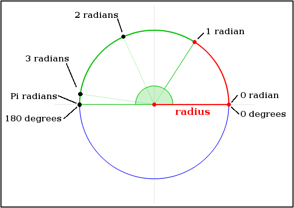
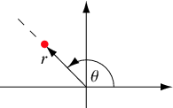
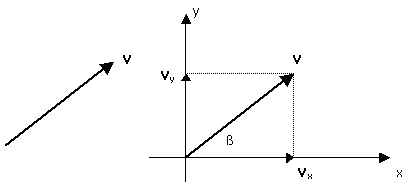

# **Creative coding avec p5.js : (cours #7)**

### Objectifs de la séance :

- Se familiariser avec le cercle trigonométrique (unitaire)
- Se familiariser avec les vecteurs 2D

# ----------------------- Let's code ---------------------------

# Le cercle trigonométrique (unitaire)

Le cercle trigonométrique est un cercle de rayon 1.  
Il permet de comprendre d'où vient le nombre pi ( π ) :  
En sachant qu'1 radian correspond au rayon de ce cercle appliqué à sa périphérie, il faut PI radians (3.1415...) pour faire 180° sur ce cercle.



Le cercle trigonométrique permet aussi d'avoir une représentation visuelle du sinus et du cosinus d'un angle :


Il est important de connaître les fonctions sin() et cos(), elles nous seront très utiles pour faire différentes oscillations, ou pour créer des motifs périodiques (se répétant).

```
// Le nombre PI est mis à disposition par p5.js comme ceci :
let maVariable1 = PI; // pour une valeur correspondant à 180°
let maVariable2 = TWO_PI; // pour une valeur correspondant à 360°
let maVariable3 = HALF_PI; // pour une valeur correspondant à 90°
```

Les fonctions cos() et sin() doivent être utilisées en leur passant une valeur en radians.  
En passant une valeur de temps à un cos() ou un sin(), on obtient une valeur qui oscille entre -1 et 1 continuellement.  
"frameCount" est un mot-clé de p5.js nous donnant le nombres de frames écoulées depuis le début.

```
let monOscillation;
let secondesPassees = frameCount / 60; // conversion des frames en secondes
monOscillation = cos(secondesPassees); // oscille entre -1 et 1
monOscillation = monOscillation * 150; // oscille entre -150 et 150

translate(200, monOscillation);
ellipse(0,0, 30,30);
```

## Pratique :

Multipliez et additionnez les valeurs nécessaires pour faire une oscillation entre 0 et 1 au lieu de -1 et 1.

# Les vecteurs 2D

Un vecteur est un concept qui existe en physique, en mathématiques et en programmation.  
Dans le cadre de ce cours, nous représenterons le vecteur de la même manière qu'on le fait en physique, par **une flèche**.  
Nous allons utiliser deux manières de définir un vecteur :

- Avec un **angle** et une **magnitude**/**longueur**  
  

ou

- Avec des **coordonnées X et Y**  
  

Nous nous servirons de ces deux définitions pour réfléchir et travailler avec les vecteurs, mais il est important de comprendre que p5.js (et beaucoup d'environnements de programmation utilisant les vecteurs) utilisent la deuxième définition (x et y). C'est à nous de faire la conversion si nécessaire.

Pour créer et utiliser un vecteur avec p5 :

```
// Créer un vecteur appelé "position" :
let position = createVector(150, 200);

// Dessiner une ellipse à la position du vecteur :
ellipse(position.x, position.y, 20, 20);
```

# Exercice en cours :

Faire un pendule qui oscille à chaque seconde, à l'aide de vecteurs et de fonctions trigonométriques.

# Exercice pour la prochaine fois :

Avec une boucle for() et ce que vous venez de faire, faites une série de pendules qui oscillent en décalé. Faites plusieurs versions avec des manières de décaler différentes (au moins 2).
